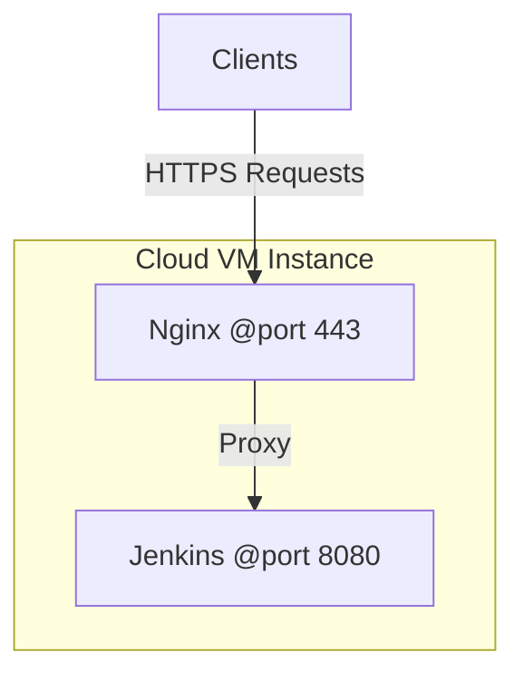

# Jenkins Setup Scripts

This repository contains a collection of scripts for setting up Jenkins with various deployment environments on Ubuntu. These scripts simplify the process of configuring Jenkins along with additional tools and frameworks such as .NET, NodeJS, Java, and more, tailored for building and deploying software projects.

## Architecture



### Description:

- **Clients**: Represents external users accessing the system.
- **Nginx**: Acts as a reverse proxy handling client requests and forwarding them to Jenkins.
- **Jenkins**: The CI/CD tool for building and deploying applications.
- **Cloud VM Instance**: Groups Nginx and Jenkins within the same virtual machine environment on Google Cloud Platform.

## Contents

- **[jenkins-dotnet.sh](jenkins-dotnet.sh)**: A Bash script to configure Jenkins with a .NET build environment on Ubuntu.

### Features of `jenkins-dotnet.sh`

- Updates the system packages.
- Installs Java Development Kit (JDK) and verifies the installation.
- Installs and configures Jenkins, ensuring it is running properly.
- Sets up HTTPS for Jenkins using Nginx and self-signed certificates.
- Installs .NET SDK and additional dependencies for building .NET projects.
- Outputs the Jenkins initial admin password for first-time login.

### Upcoming Scripts

- Jenkins setup with **NodeJS** environment.
- Jenkins setup with **Java** environment.
- Additional configurations for popular CI/CD workflows.

## Usage

### Option 1: Direct Execution

1. Download the script directly:

   ```bash
   wget https://raw.githubusercontent.com/markma85/Setup-Jenkins-Build-Env/main/jenkins-dotnet.bash
   ```

2. Make the script executable:

   ```bash
   chmod +x jenkins-dotnet.bash
   ```

3. Run the script:
   ```bash
   ./jenkins-dotnet.bash
   ```

### Option 2: Clone the Repository

1. Clone the repository to your local machine:

   ```bash
   git clone https://github.com/markma85/Setup-Jenkins-Build-Env.git
   cd Setup-Jenkins-Build-Env
   ```

2. Run the desired script, for example, to set up Jenkins with a .NET environment:

   ```bash
   chmod +x jenkins-dotnet.bash
   ./jenkins-dotnet.bash
   ```

3. Follow the prompts (e.g., entering your VM's public IP address) and monitor the output for successful installation.

4. Access your Jenkins instance in a browser using the IP address you provided:
   ```
   https://<your-public-ip>
   ```

## Prerequisites

- An Ubuntu-based system (tested on Ubuntu 20.04 and 22.04).
- Sufficient permissions to run `sudo` commands.
- Internet connectivity for downloading required packages and tools.

## Contributing

Contributions are welcome! If you have suggestions for improvements, bug fixes, or new scripts, feel free to:

1. Fork the repository.
2. Create a feature branch:
   ```bash
   git checkout -b feature/your-feature-name
   ```
3. Commit your changes:
   ```bash
   git commit -m "Add your message here"
   ```
4. Push to your branch:
   ```bash
   git push origin feature/your-feature-name
   ```
5. Open a pull request on the original repository.

## License

This project is licensed under the [MIT License](LICENSE). Feel free to use and modify the scripts as per your needs.

## Contact

For questions or support, feel free to reach out via the repository's [Issues](https://github.com/your-username/jenkins-setup-scripts/issues) section.
